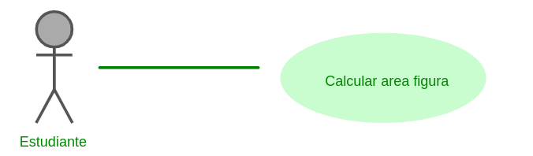
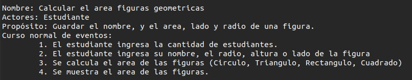
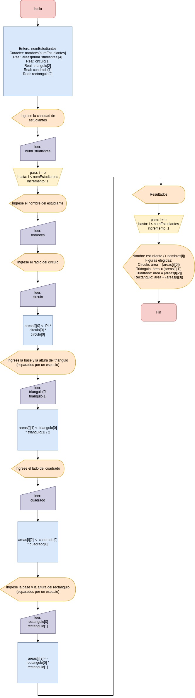
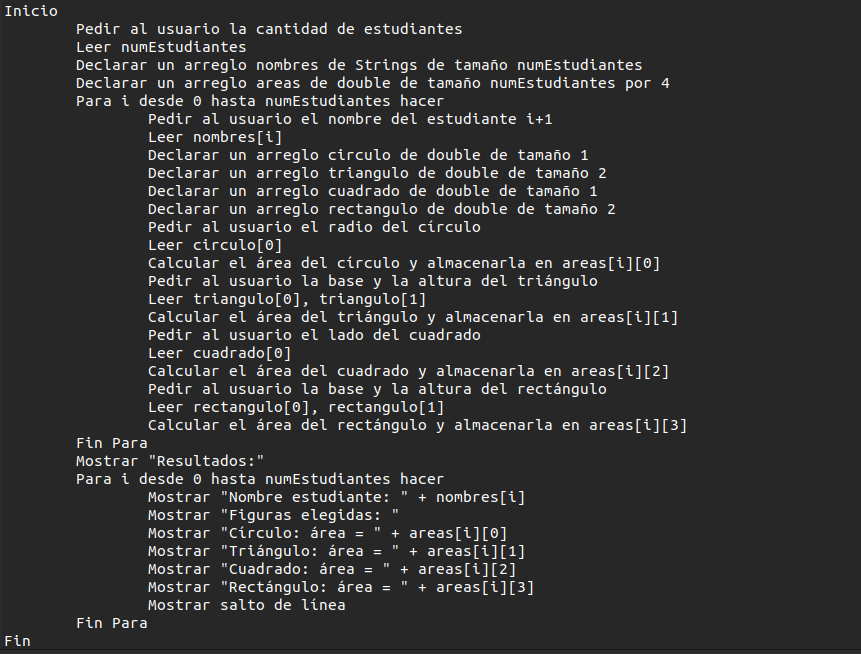

## Ejercicio Área Figuras

En su rol de desarrollador de software debe estar en la capacidad de desarrollar un programa que se encargue de encontrar el área de las siguientes figuras geometricas (circulo, cuadrado, triangulo y rectangulo).

## Análisis del Ejercicio

### Historia de usuario:

[Jira](https://hoytrabajas.atlassian.net/jira/core/projects/UN/board?selectedIssue=UN-1 "Página de jira")

Área figuras:

Descripción:

**Como** un usuario estudiante **quiero** poder sacar el área de las siguientes figuras geométricas y poder agregar a un nuevo estudiante si es el caso (Circulo, Cuadrado, Triangulo, Rectángulo), **para** nuestras clases de geometría.

Escenarios

Escenario 1: Ingresar el nombre del estudiante seguido de la información de la base y la altura y/o el radio de la figura.

**Given** que soy un estudiante y que ingreso números positivos para la operación de las figuras geométricas.

**When** ponga los datos de altura, radio y lado dependiendo la figura que estoy calculando.

**Then** debo poder calcular el área de la figura solicitada.

### Aproximación Caso de Uso:

Descripción caso de uso:

### Aproximación Diagrama de Flujo:

### Aproximación Pseudocódigo:

